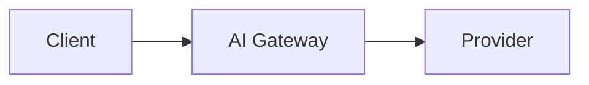

# Contributing to Ferro Labs Docs

Thank you for helping improve the Ferro Labs AI Gateway documentation! This guide explains how to contribute.

## Ways to contribute

- **Fix a typo or broken link** — open a PR directly
- **Improve an existing page** — clarify wording, add an example, fix a code snippet
- **Add a new guide or section** — open an issue first so we can align on scope
- **Report an issue** — use the GitHub issue templates

---

## Before you start

1. **Check existing issues** to see if your topic is already being discussed.
2. **For large additions** (new pages, restructured sections), open an issue first. This saves you from writing content that might need significant revision.
3. **For small fixes** (typos, broken links, code snippets), a PR without a prior issue is fine.

---

## Local setup

**Requirements**: Node.js 20+, pnpm 9+

```bash
# Install dependencies
pnpm install

# Start local dev server (hot reload at http://localhost:3000)
pnpm start

# Production build (catches broken links)
pnpm build

# TypeScript check
pnpm typecheck
```

---

## Content guidelines

### MDX format

All documentation files use `.mdx` (Markdown + JSX). Keep content in the `docs/` directory.

### Frontmatter

Every page must have at minimum:

```mdx
---
title: Your Page Title
description: A clear, one-sentence summary (aim for 150–160 characters for SEO).
keywords: [keyword one, keyword two, keyword three]
---
```

### Writing style

- **Concise and direct** — get to the point quickly; developers scan docs
- **Present tense** — "the gateway routes requests", not "the gateway will route"
- **Second person** — "you can configure…", not "the user can configure…"
- **Code examples over prose** — show a working `config.yaml` or `curl` command rather than describing it
- **Admonitions** — use `:::note`, `:::tip`, `:::warning`, `:::danger` for callouts

### Diagrams

Use Mermaid for architecture and flow diagrams:

````mdx

````

### Code blocks

Always use a language tag:

````mdx
```yaml
strategy:
  mode: fallback
```
````

Supported: `bash`, `yaml`, `json`, `go`, `python`, `typescript`, `promql`

### Links

- Internal: use absolute route paths (no `.mdx` extension) — `[Quickstart](/getting-started/quickstart)`
- External: use full URLs

---

## Page structure

```
docs/
├── intro.mdx                    ← Main landing / Introduction
├── changelog.mdx                ← Release history
├── enterprise.mdx               ← Enterprise features
├── getting-started/             ← Onboarding — quickstart, concepts, config
├── guides/                      ← How-to guides — providers, routing, plugins
├── operations/                  ← Running in production
├── security/                    ← Data handling, secrets
├── sdks/                        ← SDK compatibility
├── api-reference/               ← REST API reference (auto-generated pages)
└── faq/                         ← Frequently asked questions
```

When adding a new page, also add it to [`sidebars.ts`](./sidebars.ts).

---

## Pull request process

1. **Fork** the repo and create a branch from `development`:
   ```bash
   git checkout -b docs/your-topic development
   ```

2. **Make your changes.** Run `pnpm build` locally to catch broken links.

3. **Open a PR** against the `development` branch (not `main`).

4. **Fill in the PR template.** Describe what you changed and why.

5. A maintainer will review and merge when ready. We aim to review PRs within a few business days.

> **Note:** `main` is the production branch that deploys to [docs.ferrolabs.ai](https://docs.ferrolabs.ai). All changes go through `development` first.

---

## Reporting issues

Use the issue templates:

- **Content error / typo** — factual mistakes, broken links, outdated information
- **New content request** — suggest a new guide, example, or section

---

## License

By contributing, you agree that your contributions will be licensed under the [Apache 2.0 License](https://github.com/ferro-labs/ai-gateway/blob/main/LICENSE) — the same license as the Ferro Labs AI Gateway itself.
