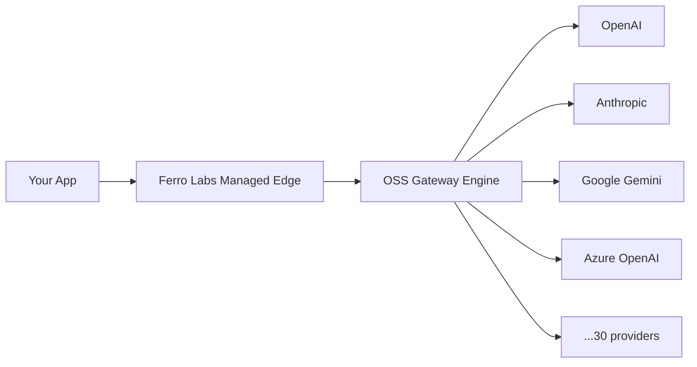

# Ferro Labs Managed — Managed AI Gateway

Ferro Labs Managed is the hosted, multi-tenant version of the Ferro Labs AI Gateway. Built on the same open-source engine that powers the self-hosted gateway — including its 11 built-in plugins, embedded dashboard, per-request cost tracking, and budget enforcement — Ferro Labs Managed adds isolated tenant instances, semantic caching, SSO/SAML, cross-tenant durable billing, and fleet controls, all operated by Ferro Labs so you never touch infrastructure.

## Architecture

Every request flows through the Ferro Labs Managed edge layer — which handles authentication, tenant isolation, rate limiting, and billing — before reaching the same open-source gateway engine used by self-hosted deployments. The engine then routes to the configured AI provider.

## What's available today

The open-source AI Gateway is fully available for self-hosting. Ferro Labs Managed plans and pricing are coming soon.

:::info Coming soon
Ferro Labs Managed pricing, plans, and feature tiers will be announced when the platform exits early access. [Join the waitlist](https://www.ferrolabs.ai/) to be notified.
:::

## How Ferro Labs Managed Differs from Self-Hosting

The self-hosted OSS gateway already ships an embedded dashboard, persists per-request cost (`cost_usd`) with spend attribution by key/provider/model, and enforces budgets with a `402 insufficient_quota` response when a limit is hit. Ferro Labs Managed builds on top of that engine rather than duplicating it — the differences are about running it hosted, at multi-tenant scale, with capabilities that don't make sense for a single self-hosted instance:

1. **Multi-tenancy and isolation** — Each tenant gets its own isolated gateway instance and credential boundary, rather than the single shared instance a self-hosted deployment runs.
2. **Zero ops** — No servers to provision, no containers to update, no TLS certificates to rotate. Ferro Labs handles uptime, scaling, and upgrades.
3. **Semantic caching** — Similarity-based cache hits across paraphrased prompts, beyond the OSS response-cache plugin's exact-match semantics. See [Semantic cache](/ferrocloud/semantic-cache).
4. **SSO/SAML and organizational controls** — SAML 2.0/OIDC sign-in, directory sync, centralized policy deployment, and team-level access controls. The five deterministic content guardrails are part of the OSS engine and work in either edition; Managed adds [CEL custom policy and external moderation preflight](/plugins/enterprise).
5. **Cross-tenant durable billing** — Consolidated usage metering and invoicing across teams, projects, and tenants, on top of the per-request cost tracking the OSS gateway already records locally.
6. **Team management** — Invite teammates, assign roles, and scope API keys to projects — all from the dashboard.

## Join the Waitlist

Ferro Labs Managed is currently in early access. Sign up to get notified when your plan is available.

[**Join the waitlist**](https://www.ferrolabs.ai/)

## Related pages

- [OSS vs Ferro Labs Managed](/guides/oss-vs-ferrocloud)
- [Managed guardrails](/plugins/enterprise)
- [Semantic cache](/ferrocloud/semantic-cache)
- [Enterprise features](/enterprise)
