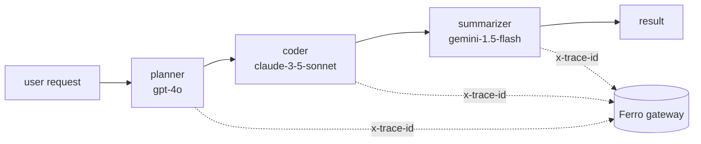

# LangGraph

LangGraph agents become a lot more interesting when each node can use the best provider for *its* job — without rewriting the graph, juggling auth, or maintaining N provider SDKs. Ferro Labs AI Gateway gives every node one URL; only the model name changes.



Three providers. Three `trace_id`s. One gateway URL. The agent code imports `langchain_ferrolabsai` and `langgraph` — nothing else.

## Install

```bash
pip install langchain-ferrolabsai "langgraph>=0.2.0,<0.3.0"
```

## Multi-provider agent in 30 lines

```python
import os
from typing import TypedDict
from langchain_core.messages import HumanMessage, SystemMessage
from langchain_ferrolabsai import FerroChatModel
from langgraph.graph import END, StateGraph

class State(TypedDict):
    request: str
    plan: str
    code: str
    summary: str

def _chat(model: str) -> FerroChatModel:
    return FerroChatModel(
        model=model,
        base_url=os.environ["FERRO_BASE_URL"],
        api_key=os.environ["FERRO_API_KEY"],
    )

PLANNER, CODER, SUMMARIZER = _chat("gpt-4o"), _chat("claude-3-5-sonnet-20241022"), _chat("gemini-1.5-flash")

def plan(s):      r = PLANNER.invoke([SystemMessage(content="Plan in 3-5 steps."), HumanMessage(content=s["request"])]); return {**s, "plan": r.content}
def code(s):      r = CODER.invoke([SystemMessage(content="Implement the plan as Python."), HumanMessage(content=s["plan"])]); return {**s, "code": r.content}
def summarize(s): r = SUMMARIZER.invoke([SystemMessage(content="One sentence."), HumanMessage(content=s["code"])]); return {**s, "summary": r.content}

g = StateGraph(State)
g.add_node("planner", plan); g.add_node("coder", code); g.add_node("summarizer", summarize)
g.set_entry_point("planner"); g.add_edge("planner", "coder"); g.add_edge("coder", "summarizer"); g.add_edge("summarizer", END)
app = g.compile()
print(app.invoke({"request": "Build a UTC-now CLI", "plan": "", "code": "", "summary": ""})["summary"])
```

That's the whole pattern — one `FerroChatModel(model=...)` per node, all pointed at the same `FERRO_BASE_URL`.

## Surface `trace_id` per step

Every `FerroChatModel` response carries the gateway's `trace_id` on `response_metadata`. Collect it per-step to correlate the agent's flow with whatever observability backend you've wired into the gateway:

```python
def plan(state):
    response = PLANNER.invoke([HumanMessage(content=state["request"])])
    print(f"[planner] trace_id={response.response_metadata['trace_id']}")
    return {**state, "plan": response.content}
```

Pair this with the [LangSmith bridge](/frameworks/langsmith) (or any other plugin) on the gateway side, and each of your nodes shows up as a separate run in the LLMOps backend of your choice — without the agent importing any LLMOps SDK.

## Verify

```bash
export FERRO_BASE_URL=http://localhost:8080
export FERRO_API_KEY=sk-ferro-...
python agent.py
```

Expected output (abridged):

```
Routing through Ferro gateway:
  [planner    · openai     · trace_id=abc-123]
  [coder      · anthropic  · trace_id=def-456]
  [summarizer · google     · trace_id=ghi-789]
```

Three different providers, three different `trace_id`s — proof that one LangGraph definition fanned out to three best-in-class models.

## Runnable example

[`ai-gateway-cookbook/python/02-langgraph-multi-provider-agent`](https://github.com/ferro-labs/ai-gateway-cookbook/tree/main/python/02-langgraph-multi-provider-agent) — the full Dockerized version of the snippet above.

```bash
git clone https://github.com/ferro-labs/ai-gateway-cookbook
cd ai-gateway-cookbook/python/02-langgraph-multi-provider-agent
cp .env.example .env
make run
```

## Why this matters

Most LangGraph examples either pick one provider and stay there (limiting agent quality) or paper over multiple providers with hand-rolled adapters (cost: every node now knows about auth, retries, billing). Ferro pushes that complexity into the gateway. The agent author writes a graph; the gateway routes, retries, tracks cost, propagates traces. Swapping `model="gpt-4o"` for `model="claude-3-5-sonnet-20241022"` is the *only* change required to A/B a different provider on a node.

## See also

- [LangChain (Python)](/frameworks/langchain-python) — full `FerroChatModel` / `FerroEmbeddings` / `FerroLLM` reference
- [LangSmith](/frameworks/langsmith) — turn the per-node `trace_id`s into LangSmith runs
- [Routing policies](/guides/routing-policies) — what the gateway does behind the scenes
- [Use cases](/guides/routing-policies) — more multi-provider patterns
