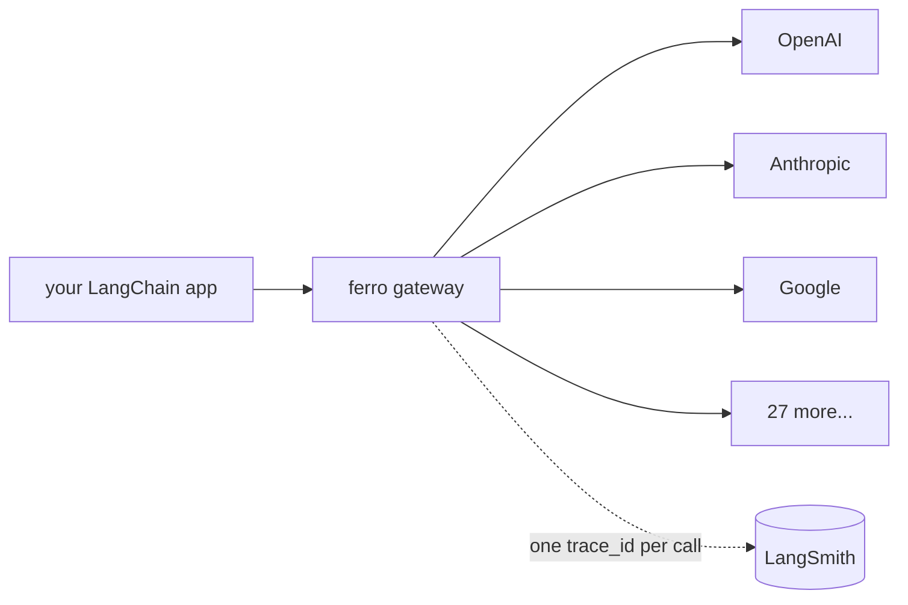

# LangSmith

LangSmith is great for tracing LangChain workloads — until you reach for a provider it doesn't natively cover, or until you swap providers and discover that your beautiful traces only ever showed OpenAI. Ferro Labs AI Gateway closes that gap with a single architectural piece: **`trace_id`**.



## How it works (today, with `langchain-ferrolabsai 0.1.0`)

The gateway issues a deterministic `trace_id` per request (W3C-compliant, propagated as the `x-trace-id` HTTP response header since `ai-gateway v1.1.0`). The [`langchain-ferrolabsai`](/frameworks/langchain-python) adapter surfaces that ID on every response:

```python
from langchain_ferrolabsai import FerroChatModel
from langchain_core.messages import HumanMessage

chat = FerroChatModel(model="claude-3-5-sonnet-20241022", base_url="...", api_key="...")
response = chat.invoke([HumanMessage(content="hi")])

trace_id = response.response_metadata["trace_id"]   # e.g. "01HK3Z7QJ8..."
provider = response.response_metadata["provider"]   # e.g. "anthropic"
```

LangSmith's own SDK creates runs whenever it wraps a LangChain call (`@traceable`, `LANGSMITH_TRACING=true`, etc.). Stamping the Ferro `trace_id` into a LangSmith run's `extra` field correlates the two halves of the system:

```python
from langsmith import Client

ls = Client()
ls.update_run(
    run_id,
    extra={
        "ferro_trace_id": response.response_metadata["trace_id"],
        "ferro_provider": response.response_metadata["provider"],
        "ferro_cost_usd": response.response_metadata.get("cost_usd"),
    },
)
```

That `ferro_trace_id` is the canonical link to the gateway's logs, metrics, and (soon) bridge-plugin exports.

## How it will work (with the `langsmith` bridge plugin — v1.2)

The fuller story: **one gateway plugin, every framework gets LangSmith traces for free**.

The [`ai-gateway-plugins`](https://github.com/ferro-labs) repo will ship an `observability/langsmith` plugin that consumes the gateway's internal `Exporter` contract (frozen in v1.1.0) and forwards every chat / embedding call to LangSmith's ingest endpoint with the gateway's `trace_id`, provider, model, cost, latency, prompt, and response.

When that plugin is enabled on the gateway, your app code stays exactly as above — you don't import `langsmith` at all. Calls from raw `openai`, `langchain`, `llamaindex`, `crewai`, **and** the [Vercel AI SDK](/frameworks/vercel-ai-sdk) all show up as LangSmith runs from a single Go implementation. The architectural rule we follow is: **framework adapters live SDK-side (one per framework, per language); observability bridges live gateway-side (one per backend, in Go, reused everywhere)**.

## Why this matters

The standard LangSmith setup is implicitly OpenAI-shaped. Most non-OpenAI providers either don't appear in your dashboards or require per-provider integration code. With Ferro:

- **Provider-agnostic traces.** Anthropic, Gemini, Bedrock, Vertex, Cohere, DeepSeek, Mistral, Groq, Together, Cloudflare, NVIDIA NIM, OpenRouter, Replicate, Cerebras, SambaNova, xAI — they all flow through one URL, all emit one trace shape, and (when the bridge ships) all land in LangSmith as runs.
- **No per-provider auth in your app.** Provider credentials live on the gateway. Your LangSmith runs reference whatever model name you asked for; the gateway figures out which provider to call.
- **Switch backends without code changes.** Disable the `langsmith` plugin, enable `langfuse` or `phoenix`, restart the gateway. Your app code doesn't change.

## Verify the trace_id round-trips

```bash
curl -i http://localhost:8080/v1/chat/completions \
  -H "Authorization: Bearer sk-ferro-..." \
  -H "Content-Type: application/json" \
  -d '{"model":"gpt-4o-mini","messages":[{"role":"user","content":"hi"}]}' \
  | grep -i '^x-trace-id'
```

Expected:

```
x-trace-id: 01HK3Z7QJ8XYZABC123...
```

That value matches `response.response_metadata["trace_id"]` from `FerroChatModel` and will match the eventual LangSmith `ferro_trace_id` extra field.

## Runnable example

[`ai-gateway-cookbook/python/04-langsmith-tracing`](https://github.com/ferro-labs/ai-gateway-cookbook) is the planned recipe that demos the full path — it lands alongside the `observability/langsmith` plugin in the v1.2 release. The [LangGraph multi-provider recipe](/frameworks/langgraph#runnable-example) already shows the surfacing side today.

## Status

| Capability | Status |
|---|---|
| `trace_id` surfaced on every `FerroChatModel` response | ✅ Live (in `langchain-ferrolabsai 0.1.0`) |
| `x-trace-id` HTTP response header | ✅ Live (since `ai-gateway v1.1.0`) |
| `observability/langsmith` bridge plugin | 🚧 Planned for v1.2 |
| End-to-end cookbook recipe | 🚧 Planned for v1.2 (alongside the bridge) |

## See also

- [LangChain (Python)](/frameworks/langchain-python)
- [LangGraph](/frameworks/langgraph)
- [Observability guide](/guides/observability) — gateway-side metrics, logs, OTLP
