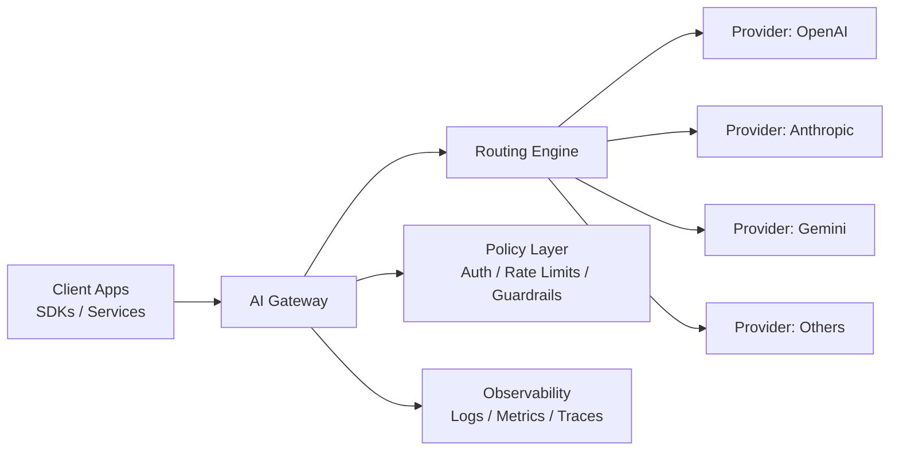
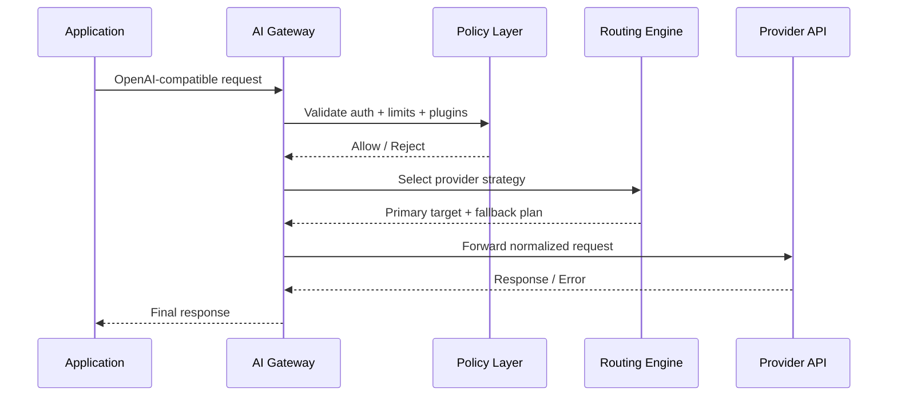

This page gives a practical architecture view similar to modern AI gateway docs: control points, traffic flow, and scaling boundaries.

## High-level architecture

## Request path

## Core components

### API compatibility layer

- Accepts OpenAI-compatible request/response formats.
- Lets application code remain stable while backend models/providers change.

### Routing engine

- Supports single, fallback, weighted, and conditional strategies.
- Separates model selection policy from app logic.

### Policy and controls

- Handles authentication, rate limiting, and plugin-level checks.
- Applies policy consistently for every provider.

### Observability

- Emits logs for every request and upstream outcome.
- Exposes metrics for latency, error rate, and provider health.

## Deployment recommendations

- Start with one gateway instance behind a reverse proxy.
- Move to multiple gateway replicas with shared configuration for HA.
- Add provider-level fallback before introducing weighted distribution.
- Use metrics + request logs to tune routing rules over time.

## Related pages

- [Request lifecycle](/getting-started/request-lifecycle)
- [Routing policies](/guides/routing-policies)
- [Observability](/guides/observability)
