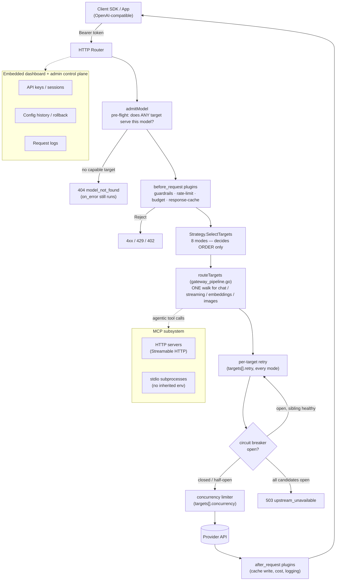
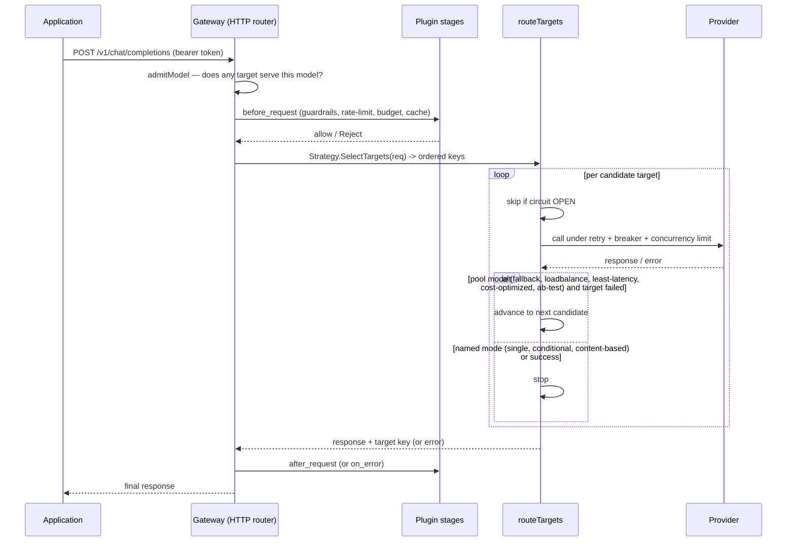

This page describes how a single gateway instance is actually built: one routing
pipeline shared by every surface, the plugin stages that wrap it, the embedded
dashboard and admin control plane, the MCP subsystem, and the state that does
(and doesn't) survive a restart or scale across replicas.

## High-level architecture

```mermaid
flowchart TB
    Client["Client SDK / App<br/>(OpenAI-compatible)"] -->|Bearer token| Router["HTTP Router"]

    Router --> Admit["admitModel<br/>pre-flight: does ANY target serve this model?"]
    Admit -->|"no capable target"| Deny404["404 model_not_found<br/>(on_error still runs)"]
    Admit --> Before["before_request plugins<br/>guardrails · rate-limit · budget · response-cache"]
    Before -->|Reject| DenyPlugin["4xx / 429 / 402"]
    Before --> Strategy["Strategy.SelectTargets<br/>8 modes — decides ORDER only"]

    Strategy --> Pipeline["routeTargets (gateway_pipeline.go)<br/>ONE walk for chat / streaming / embeddings / images"]
    Pipeline --> Retry["per-target retry<br/>(targets[].retry, every mode)"]
    Retry --> CB{"circuit breaker<br/>open?"}
    CB -->|open, sibling healthy| Retry
    CB -->|closed / half-open| Limiter["concurrency limiter<br/>(targets[].concurrency)"]
    Limiter --> Provider[("Provider API")]
    Provider --> After["after_request plugins<br/>(cache write, cost, logging)"]
    After --> Client
    CB -->|"all candidates open"| Deny503["503 upstream_unavailable"]

    Pipeline -.->|agentic tool calls| MCP
    Router -.-> Admin

    subgraph MCP["MCP subsystem"]
        direction LR
        HTTPT["HTTP servers<br/>(Streamable HTTP)"]
        StdioT["stdio subprocesses<br/>(no inherited env)"]
    end

    subgraph Admin["Embedded dashboard + admin control plane"]
        direction LR
        Keys["API keys / sessions"]
        Cfg["Config history / rollback"]
        Logs["Request logs"]
    end
```

The dashboard is not a separate service — it's a static SPA bundle embedded in
the same binary and served from the gateway's root path, behind the same
bearer-auth chain as the admin API.

## Request path

```mermaid
sequenceDiagram
    participant App as Application
    participant GW as Gateway (HTTP router)
    participant Plug as Plugin stages
    participant Pipe as routeTargets
    participant Prov as Provider

    App->>GW: POST /v1/chat/completions (bearer token)
    GW->>GW: admitModel — does any target serve this model?
    GW->>Plug: before_request (guardrails, rate-limit, budget, cache)
    Plug-->>GW: allow / Reject
    GW->>Pipe: Strategy.SelectTargets(req) -> ordered keys
    loop per candidate target
        Pipe->>Pipe: skip if circuit OPEN
        Pipe->>Prov: call under retry + breaker + concurrency limit
        Prov-->>Pipe: response / error
        alt pool mode (fallback, loadbalance, least-latency,<br/>cost-optimized, ab-test) and target failed
            Pipe->>Pipe: advance to next candidate
        else named mode (single, conditional, content-based)<br/>or success
            Pipe->>Pipe: stop
        end
    end
    Pipe-->>GW: response + target key (or error)
    GW->>Plug: after_request (or on_error)
    GW-->>App: final response
```

## Core components

### Unified routing pipeline (`routeTargets`)

This is the defining piece of the current architecture. Chat, streaming chat,
embeddings, and image generation all route through the **same** function,
`routeTargets` in `gateway_pipeline.go` — not four parallel implementations.
The strategy contributes target *order* and nothing else; everything that
happens once a target is chosen lives in the pipeline, once, for all four
surfaces:

- per-target **retry** (`targets[].retry` — honoured under **every** routing
  mode, not only `fallback`)
- the per-target **circuit breaker** (one breaker per `virtual_key`, shared
  across all four surfaces — a target that only ever fails `/v1/embeddings`
  can still trip the breaker that stops it serving chat)
- the per-target **concurrency limiter** (`targets[].concurrency` —
  `max_concurrency` + `queue_size`; overflow returns 429)
- error classification, latency recording, metrics, and request logging

Plugin stages run **outside** this walk on purpose: a retry that re-ran a
budget or guardrail plugin would bill or check the same request multiple
times for one call. The pass-through `/v1/*` proxy and the priced
`/v1/responses` surface both run through the same admission, plugin, and
routing lifecycle as the four routed surfaces — they aren't a separate,
ungoverned code path.

### API compatibility layer

Accepts OpenAI-compatible request/response shapes so application code stays
stable as backend models and providers change. Requests to endpoints the
gateway doesn't natively model (most non-chat OpenAI routes) fall through to
the pass-through proxy, which still runs the governed lifecycle above.

### Routing strategy

Selects and orders candidate targets — nothing more. All 8 modes implement
one method, `SelectTargets`: `single`, `fallback`, `loadbalance`,
`conditional`, `content-based`, `least-latency`, `cost-optimized`, and
`ab-test`. See [Routing](/routing) for per-strategy config and examples.

### Plugin stages

Global middleware (`before_request`, `after_request`, `on_error`) wrapping
the pipeline — guardrails, rate limiting, budget enforcement, response
caching, and request logging. See [Plugins](/plugins) for stage semantics and
failure policy.

### MCP subsystem

External tool servers for agentic tool-calling, wired from `mcp_servers[]` in
config. Each entry is exactly one transport: `url` for Streamable HTTP, or
`command`/`args` for a stdio subprocess (which inherits **no** gateway
environment — only `PATH`/`HOME`/`LANG`/`TMPDIR` plus its own `env` block).
Guardrails and budget checks re-run on every agentic loop turn, not just the
first. See [MCP](/guides/mcp).

### Embedded dashboard + admin control plane

The operations dashboard is a React SPA embedded in the OSS binary and served
from the gateway's root path — there's no standalone dashboard container or
second origin. The admin control plane behind it (API keys, dashboard
sessions, config history/rollback, request logs, audit trail) uses the same
bearer-auth chain the data plane does, so the in-browser Playground can call
`/v1/*` with the operator's own session.

### Observability

Emits Prometheus metrics at `/metrics` and, when configured, OpenTelemetry
traces. Health is split three ways:

| Endpoint | Answers | Auth |
|---|---|---|
| `/livez` | Is the process up? | none |
| `/readyz` | Can it serve traffic? 503 `no routable targets` when zero targets are routable | none |
| `/health` | Deep diagnostic — per-provider status and circuit state | none |

## Failover: pool vs named modes

A circuit breaker doesn't produce failover by itself — a deployment with no
breaker configured still fails over. The two do different jobs: the breaker
makes failover **cheap** (skips a dead target's connection timeout), the
routing mode makes it **happen** (decides whether to try a sibling at all).

| | Modes | On a target failure |
|---|---|---|
| **Pool** | `fallback`, `loadbalance`, `least-latency`, `cost-optimized`, `ab-test` | the walk advances to the next candidate after a failover-safe failure; any other `4xx` is returned |
| **Named** | `single`, `conditional`, `content-based` | the walk stays inside what was named: `single` stops; a rule walks its `target_keys` chain on the same failover-safe failures and stops at its end |

A pool mode picks its head target for a reason that's about the *pool* —
spread load, take the cheapest, take the fastest — from targets declared
interchangeable, so handing the request to a sibling is what was configured.
A named mode picks its head because something named that target
specifically; serving from a target the rule did not name would demote the
rule to a suggestion, so a rule's `target_keys` chain is a hard boundary.

**Every mode skips a target whose circuit is open, or that is parked after a
`429`, among the candidates it offers** — a pool's siblings, or a rule's chain.
`single` and a rule with one target offer no other candidate, so an open
circuit there is refused with `503`. When *no* other target serves the model, the walk still attempts
the open one (so a model that plainly exists never 404s), the breaker
refuses it, and the caller gets `503 upstream_unavailable` instead.

## Scaling boundaries

Several pieces of gateway state are **per-process** and do not share across
replicas unless noted:

- Circuit breaker state, the least-latency tracker's p50 samples, and the
  `rate-limit` plugin's token buckets all reset with the process and are not
  shared across instances.
- The `response-cache` and `budget` plugins are in-memory by default; budget
  spend does not survive a restart and is not a durable billing ledger.
- The per-IP HTTP rate limiter (`RATE_LIMIT_RPS`) is also per-process.

What **does** persist and can be shared, when backed by `sqlite` or
`postgres` (`API_KEY_STORE_BACKEND`, `CONFIG_STORE_BACKEND`,
`REQUEST_LOG_STORE_BACKEND`): API keys, dashboard sessions, config history,
the audit trail, and request logs. Point every replica at the same backend
DSN to share those across a fleet; the in-memory default (used when these are
unset) keeps each replica's copy independent and loses it on restart.

## Deployment recommendations

- Start with one gateway instance; `ferrogw init` scaffolds a config from
  whichever provider credentials are already in the environment.
- Set `GATEWAY_ENV=production` before exposing an instance publicly — it
  refuses to start with `ALLOW_UNAUTHENTICATED_PROXY=true` or a wildcard
  `CORS_ORIGINS`, and warns on the in-memory key store.
- Move to multiple replicas behind a load balancer for HA; point
  `API_KEY_STORE_BACKEND`/`CONFIG_STORE_BACKEND`/`REQUEST_LOG_STORE_BACKEND`
  at a shared `postgres` DSN so keys, config history, and logs agree across
  instances (per-process state above still won't share).
- Configure a `circuit_breaker` on any target that can fail, and prefer a
  pool routing mode (`fallback`/`loadbalance`) over a named one where
  interchangeable providers exist — that's what makes failover automatic
  rather than a manual failure to notice.
- Use `/metrics` and `/admin/logs` to tune retry, concurrency, and routing
  weights over time.

## Related pages

- [Request lifecycle](/getting-started/request-lifecycle)
- [Routing](/routing)
- [Plugins](/plugins)
- [MCP](/guides/mcp)
- [Server settings](/operations/server-settings)
- [Monitoring](/operations/monitoring)
