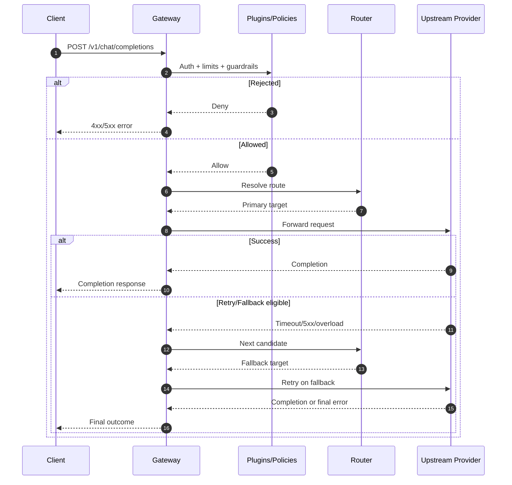
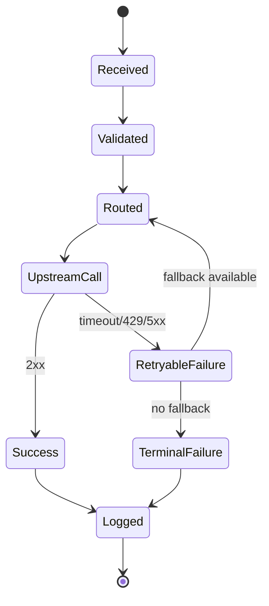

This page explains the full lifecycle from client request to provider response, including retries and fallback.

## Lifecycle stages

1. **Ingress**: Gateway receives an OpenAI-compatible request.
2. **Validation**: Authentication and request shape checks run.
3. **Policy checks**: Rate limits, plugins, and controls are applied.
4. **Routing decision**: Strategy picks primary provider/model.
5. **Execution**: Request is sent upstream.
6. **Recovery**: Retry/fallback runs on eligible failures.
7. **Egress**: Response and metadata are returned to client.
8. **Telemetry**: Logs and metrics are emitted.

## Detailed sequence

## Error handling state flow

## Practical notes

- Keep retries bounded to avoid amplifying upstream incidents.
- Prefer fallback across providers, not only models in one provider.
- Track per-stage latency to spot bottlenecks early.

## Related pages

- [Architecture](/getting-started/architecture)
- [Configuration](/getting-started/configuration)
- [Operations monitoring](/operations/monitoring)
