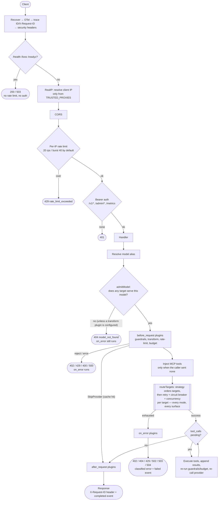

This page traces the ordered path a request takes through the gateway: the HTTP
middleware chain, model admission, the plugin stages, the single routing
pipeline shared by chat, streaming, embeddings, and image generation, the
optional MCP tool-calling loop, and how failures are classified into an HTTP
status.

## Overview

```mermaid
flowchart TD
    C([Client]) --> MW["Recover → OTel → trace ID/X-Request-ID<br/>→ security headers"]
    MW --> Probe{"/health /livez /readyz?"}
    Probe -- yes --> ProbeResp(["200 / 503<br/>no rate limit, no auth"])
    Probe -- no --> RIP["RealIP: resolve client IP<br/>only from TRUSTED_PROXIES"]
    RIP --> CORS[CORS]
    CORS --> RL{"Per-IP rate limit<br/>20 rps / burst 40 by default"}
    RL -- over --> Err1(["429 rate_limit_exceeded"])
    RL -- ok --> Auth{"Bearer auth<br/>/v1/*, /admin/*, /metrics"}
    Auth -- none --> Err2(["401"])
    Auth -- ok --> H[Handler]

    H --> Alias[Resolve model alias]
    Alias --> Admit{"admitModel:<br/>does any target serve this model?"}
    Admit -- "no (unless a transform plugin is configured)" --> Err3(["404 model_not_found<br/>on_error still runs"])
    Admit -- yes --> Before["before_request plugins<br/>guardrails, transform, rate-limit, budget"]
    Before -- reject / error --> Err4(["402 / 429 / 400 / 500<br/>on_error runs"])
    Before -- "SkipProvider (cache hit)" --> After
    Before --> MCPInj["Inject MCP tools<br/>only when the caller sent none"]
    MCPInj --> Walk[["routeTargets: strategy orders targets,<br/>then retry + circuit breaker + concurrency<br/>per target — every mode, every surface"]]
    Walk -- exhausted --> OnErr[on_error plugins]
    OnErr --> Err5(["402 / 404 / 429 / 502 / 503 / 504<br/>classified error + failed event"])
    Walk -- success --> Loop{"tool_calls<br/>pending?"}
    Loop -- yes --> Tools["Execute tools, append results,<br/>re-run guardrails/budget, re-call provider"]
    Tools --> Loop
    Loop -- no --> After[after_request plugins]
    After --> Resp(["Response<br/>X-Request-ID header + completed event"])
```

## HTTP middleware chain

Every request runs through the root chain in order: panic recovery that still
returns the gateway's JSON error envelope, an OpenTelemetry layer that extracts
an inbound W3C `traceparent` (a no-op with no OTLP endpoint configured), a
logging layer that assigns or propagates the trace ID and sets the
`X-Request-ID` response header, and baseline security headers (CSP,
`X-Frame-Options`, HSTS on TLS).

`/health`, `/livez`, and `/readyz` are mounted at this point — deliberately
**ahead of** IP resolution, rate limiting, and auth, so a traffic burst against
`/v1/*` that exhausts one IP's bucket can never also 429 an orchestrator's
liveness probe. Every other route sits behind an additional chain:

1. **Client IP resolution** — `X-Forwarded-For` / `X-Real-IP` are honored only
   when the direct TCP peer falls inside a `TRUSTED_PROXIES` CIDR (default:
   loopback only). When trusted, the forwarded chain is read **from the right**
   — the hop nearest the gateway — so a caller cannot spoof their address by
   prepending fake entries to the header.
2. **CORS**, applying the configured allowed origins.
3. **Per-IP rate limit** — **on by default** (20 requests/sec, burst 40, keyed
   on the resolved client IP, up to 100,000 tracked IPs). `RATE_LIMIT_RPS=0`
   removes this middleware entirely.
4. **Auth** — a bearer token is required on `/v1/*` (unless
   `ALLOW_UNAUTHENTICATED_PROXY=true`), on every `/admin/*` route, and on
   `/metrics` (`read_only` or `admin` scope; `/debug/*` needs `admin`).

## Model admission and before_request plugins

`POST /v1/chat/completions` resolves any configured model alias, then the
gateway asks **admitModel**: does any configured target serve this model at
all? This runs *before* the plugin stage on purpose — a rate limiter spends a
token and a budget spends money, so a model no target can ever reach must not
be allowed to spend either on its way to a 404. A refusal here still runs
`on_error`, so the denial is recorded like any other. The check is skipped when
a `before_request` plugin reports itself a transform, since a transform is
exactly what can turn an unroutable alias into a routable model id.

`before_request` plugins then run in configured order (guardrails, transforms,
rate-limit, budget). A `Reject` verdict ends the stage with a 4xx/429/402; a
plugin **error** fails closed (500) for every type except logging and metrics,
which fail open.

:::note SkipProvider, not Skip
`Context.Skip` was removed. <!-- accuracy-ok: documenting the v1.4.0 removal --> The response-cache plugin (and anything similar)
now sets **`Context.SkipProvider`**, which suppresses only the upstream
provider call. Every remaining `before_request` plugin still runs, and so does
the whole `after_request` stage — a cache hit can no longer disable a guardrail,
rate limiter, or budget check behind it.
:::

When MCP servers are configured, their tool definitions are added to the
request — but **only when the caller supplied no `tools` of their own**. A
request that already carries tools passes through untouched; the gateway never
merges or de-duplicates against it.

## Routing pipeline: one walk for every surface

Chat, streaming, embeddings, and image generation all route through the same
walk. A routing strategy (`single`, `fallback`, `loadbalance`,
`least-latency`, `cost-optimized`, `conditional`, `content-based`, `ab-test`)
decides target **order** only — retry, circuit breaking, concurrency limiting,
and error classification live once in the pipeline, so the four surfaces
cannot drift from each other.

For each candidate target the pipeline applies, in this order: the target's
`retry` policy, its circuit breaker, then its concurrency limiter, then the
provider call.

**`targets[].retry` is honored under every routing mode** — not only
`fallback`. It controls how many times the pipeline re-asks the *same* target
(default: 1 attempt, i.e. no retry, if `attempts` is unset or `0`). Whether the
walk tries a **different** target after that is a separate question, decided
by the mode:

| Mode family | Modes | On a failed target |
|---|---|---|
| Pool | `fallback`, `loadbalance`, `least-latency`, `cost-optimized`, `ab-test` | Advances to the next candidate after a failover-safe failure; other `4xx` are returned |
| Named | `single`, `conditional`, `content-based` | Stays inside what was named: `single` stops; a rule walks its `target_keys` chain and stops at its end |

Both families skip a target whose circuit breaker is **open**, or that is
parked after a `429`, among the candidates the mode offers — a pool's
siblings, or a rule's chain. `single` and a one-target rule offer no other
candidate. When every eligible candidate is unavailable, the walk still
attempts one anyway rather than reporting a false 404, and the breaker turns
that attempt into a `503`.

## MCP agentic loop

When MCP participates and the provider's response carries `tool_calls`, the
gateway executes the requested tools, appends the assistant message and the
tool results to the conversation, and re-calls the provider — repeating until
no `tool_calls` remain or the configured depth limit is reached. Each
intermediate call is forced non-streaming so the response can be inspected.

Every loop turn is a real provider call, so every turn faces the plugins that
bound one: `before_request` guardrails, the rate-limit plugin, and the budget
plugin all re-run per turn (transform, logging, and metrics plugins are
skipped, so the model isn't rewritten mid-conversation and nothing is
double-counted). Budget's per-turn check includes what this request has
already spent, so a long tool-calling conversation can be cut off by the spend
cap mid-loop. Token usage and cost accumulate across every turn and are
reported on the final response.

## Streaming path

When MCP servers are registered, the caller sent no `tools` of its own, and the
registry has discovered tools, a `stream: true` request is redirected through
the same non-streaming path described above so the full agentic loop can run
to completion — the final response is then wrapped into a single terminal
`chat.completion.chunk`. A request that supplies its own `tools` bypasses MCP
entirely and streams normally, unaffected by any configured server.

Otherwise: model admission and `before_request` plugins run exactly as above,
then the pipeline selects and starts a streaming-capable target under the same
retry, breaker, and concurrency rules. This is the only safe retry window —
once the provider's stream channel is handed back, nothing is retried or
replayed. The raw channel is then wrapped by a metering layer that counts
input/output tokens, computes cost from the model catalog, records
time-to-first-token and total latency, runs the `after_request` stage once the
stream completes, updates the circuit breaker's outcome, and emits Prometheus
metrics plus the `completed` or `failed` event when the stream drains.

## Error classification and on_error

`on_error` plugins always run on a failure — a model-admission refusal, a
`before_request` rejection or plugin error, an `after_request` plugin error, or
an exhausted routing walk — so a denied or failed request is never missing from
the log.

| Status | Code | Cause |
|---|---|---|
| 402 | `insufficient_quota` | The budget plugin's spend cap is exhausted |
| 404 | `model_not_found` | No configured target serves the model |
| 429 | `rate_limit_exceeded` | A rate-limit-type plugin denial, or the upstream itself returned 429 |
| 429 | `provider_saturated` | The target's concurrency limit and queue are both full |
| 503 | `upstream_unavailable` | The target's circuit breaker is open |
| 504 | `gateway_timeout` | The gateway's `request_timeout` (or the caller's own deadline) elapsed |
| 502 | `upstream_auth_error` / `upstream_error` | Upstream returned 401/403, or an unclassified 5xx |
| 400 | `unsupported_parameter` | `compatibility.on_unsupported_param: reject` matched an unsupported field |

An upstream `400`/`422`/`404` passes through with the provider's own message —
the one case where upstream text reaches the caller — because it describes the
request's own shape and is the caller's to fix.

## Related pages

- [Architecture](/getting-started/architecture)
- [Configuration](/getting-started/configuration)
- [Routing](/routing)
- [Plugins](/plugins)
- [API errors](/api-reference/errors)
- [Operations monitoring](/operations/monitoring)
