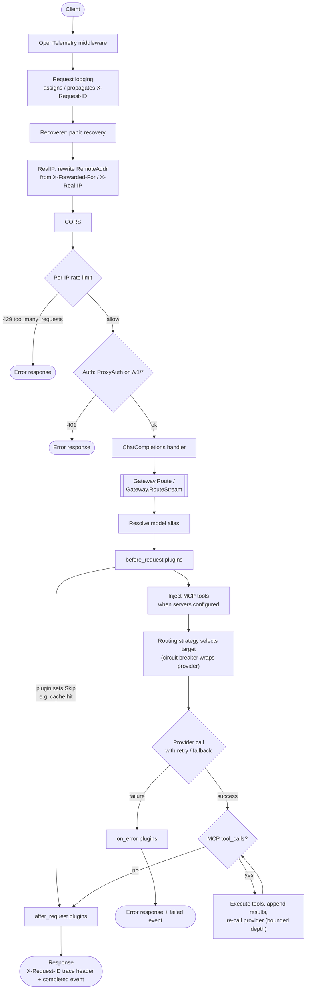

This page traces a request through the gateway exactly as the code runs it. The
two anchors are the HTTP middleware chain in
[`internal/httpserver/router.go`](https://github.com/ferro-labs/ai-gateway/blob/main/internal/httpserver/router.go)
and the routing core in
[`gateway.go`](https://github.com/ferro-labs/ai-gateway/blob/main/gateway.go)
(`Route` and `RouteStream`).

## Overview

```mermaid
flowchart TD
    C([Client]) --> OTel[OpenTelemetry middleware]
    OTel --> Log["Request logging<br/>assigns / propagates X-Request-ID"]
    Log --> Rec[Recoverer: panic recovery]
    Rec --> RIP["RealIP: rewrite RemoteAddr<br/>from X-Forwarded-For / X-Real-IP"]
    RIP --> CORS[CORS]
    CORS --> RL{Per-IP rate limit}
    RL -- "429 too_many_requests" --> Err1([Error response])
    RL -- allow --> Auth{Auth: ProxyAuth on /v1/*}
    Auth -- "401" --> Err2([Error response])
    Auth -- ok --> H[ChatCompletions handler]

    H --> GW[["Gateway.Route /<br/>Gateway.RouteStream"]]
    GW --> Alias[Resolve model alias]
    Alias --> Before[before_request plugins]
    Before -- "plugin sets Skip<br/>e.g. cache hit" --> After
    Before --> MCPInj["Inject MCP tools<br/>when servers configured"]
    MCPInj --> Strat["Routing strategy selects target<br/>(circuit breaker wraps provider)"]
    Strat --> Prov{"Provider call<br/>with retry / fallback"}
    Prov -- failure --> OnErr[on_error plugins]
    OnErr --> Err3([Error response + failed event])
    Prov -- success --> Loop{"MCP tool_calls?"}
    Loop -- yes --> Tools["Execute tools, append results,<br/>re-call provider (bounded depth)"]
    Tools --> Loop
    Loop -- no --> After[after_request plugins]
    After --> Resp(["Response<br/>X-Request-ID trace header + completed event"])
```

## 1. HTTP middleware chain

The chain is assembled in `NewRouter` (`router.go` lines 52–68) and runs in this
order for every request:

1. **OpenTelemetry** — `gwotel.Middleware` (`router.go:52`). Runs first so any
   inbound W3C `traceparent` is extracted into the request context before
   logging needs it. With no OTLP provider configured it is a cheap no-op.
2. **Request logging** — `logging.Middleware` (`router.go:53`). Resolves a trace
   ID and sets the `X-Request-ID` response header
   (`internal/logging/logger.go:94`). Precedence: (1) a trace ID already on the
   context from the OTel layer, (2) the inbound `X-Request-ID` header, (3) a
   freshly generated 16-byte hex ID. This is what keeps the OTel `trace_id`, the
   log trace ID, and the `X-Request-ID` header equal for a request.
3. **Recoverer** — `chimw.Recoverer` (`router.go:54`). Recovers from panics in
   downstream handlers and turns them into a 500 instead of crashing the server.
4. **RealIP** — `chimw.RealIP` (`router.go:62`). Rewrites `RemoteAddr` from
   `X-Forwarded-For` / `X-Real-IP` so per-IP rate limiting and request logs see
   the real client IP rather than the load balancer's. Intended for deployment
   behind a trusted proxy.
5. **CORS** — `middleware.CORS(corsOrigins...)` (`router.go:63`). Applies the
   configured allowed origins.
6. **Per-IP rate limit** — `middleware.RateLimit(rlStore)` (`router.go:67`),
   mounted only when a rate-limit store is configured. A token-bucket keyed on
   client IP; over-limit requests get `429` with an OpenAI-shaped
   `rate_limit_exceeded` error (`internal/middleware/ratelimit.go`).
7. **Auth** — `middleware.ProxyAuth(store, masterKey)`
   (`router.go:195`, applied inside `mountOpenAIRoutes`). Guards the `/v1/*`
   routes with bearer-token auth. It delegates to `admin.AuthMiddleware`, unless
   `ALLOW_UNAUTHENTICATED_PROXY=true` is set for local dev
   (`internal/middleware/proxyauth.go`).

The first five run for the whole router; rate limit is conditional; auth is
scoped to the OpenAI-compatible `/v1/*` group. `/health`, the dashboard, and
admin routes are mounted separately (`router.go:70–73`).

## 2. Handler and gateway routing

`POST /v1/chat/completions` lands in the `ChatCompletions` handler, which calls
`Gateway.Route` (non-streaming) or `Gateway.RouteStream` (when `stream: true`).
`Route` (`gateway.go:397`) executes these stages in order:

1. **Alias resolution** — `resolveAlias` (`gateway.go:422`) rewrites `req.Model`
   to its configured target from `config.Aliases` before any routing decision
   (`gateway.go:2085`).
2. **`before_request` plugins** — `runBeforePlugins` (`gateway.go:432`). Runs
   guardrails, transforms, and rate-limit-style plugins. If a plugin sets
   `Skip` with a response (for example a cache hit), `after_request` plugins
   still fire and that early response is returned immediately
   (`gateway.go:382`). A plugin error increments the `Rejected` metric and
   aborts.
3. **Routing strategy selects a target** — `getStrategy` (`gateway.go:427`,
   built in `gateway.go:890`) constructs the strategy from
   `config.strategy.mode`: `single`, `fallback`, `loadbalance`, `latency`,
   `cost-optimized`, `conditional`, `content-based`, or `ab-test`. The provider
   lookup closure transparently wraps each target in a **circuit breaker**
   (`cbProvider`, `gateway.go:1030`): an open circuit short-circuits with
   `ErrCircuitOpen` instead of calling the provider.
4. **Provider call with retry / fallback** — `s.Execute` (`gateway.go:489`)
   performs provider selection and the actual upstream call. In `fallback` mode,
   per-target retry (attempts, status codes, backoff) is applied
   (`gateway.go:938`) and the strategy advances to the next target on eligible
   failures.
5. **`after_request` plugins** or **`on_error` plugins** — on success,
   `after_request` plugins run (logging, caching) and may rewrite the response
   (`gateway.go:579`). On failure, `on_error` plugins run, the error is
   classified (`circuit_open` vs `provider_error`), metrics and a `failed`
   lifecycle event are emitted, and the error is returned (`gateway.go:495`).
6. **Response** — `recordSuccess` (`gateway.go:595`) emits Prometheus metrics,
   computes cost from the model catalog, stamps the trace span, and dispatches
   the `completed` event. The response carries the `X-Request-ID` trace header
   set back in the logging middleware.

## 3. MCP agentic loop

When MCP servers are configured, the gateway injects their tool definitions into
the request before routing (`gateway.go:450`), de-duplicating against any tools
the caller already supplied. After the first provider response, the agentic loop
runs (`gateway.go:544`):

- `ShouldContinueLoop` checks whether the model returned `tool_calls` and the
  call depth is under the configured limit.
- `ResolvePendingToolCalls` executes the requested tools and returns the
  assistant message plus one tool-result message per call.
- Those messages are appended to `req.Messages` and the provider is called again
  (`gateway.go:565`).

The loop repeats until the model stops emitting `tool_calls` or the depth limit
is reached. Intermediate calls are forced non-streaming so each response can be
inspected for tool calls (`gateway.go:477`).

## 4. Streaming path

`RouteStream` (`gateway.go:1163`) handles `stream: true`:

- **MCP redirect** — if MCP servers are registered, the request is routed
  through `Route` so the full agentic loop runs to completion, then the final
  response is wrapped into a **single final chunk** via `responseStream`
  (`gateway.go:1200`, `gateway.go:1420`). This is the current Phase 1 behavior:
  the streaming caller still sees `stream: true` in emitted events, but receives
  one terminal `chat.completion.chunk`.
- **Normal streaming** — `before_request` plugins run, then
  `resolveStreamingProviderLocked` (`gateway.go:1242`) orders targets per
  strategy mode and picks a circuit-breaker-aware streaming provider.
  `sp.CompleteStream` opens the upstream channel (`gateway.go:1278`).
- **Token metering** — the raw channel is wrapped by `streamwrap.Meter`
  (`gateway.go:1417`), which counts input/output tokens, computes cost from the
  catalog, records TTFT/TTLT timings, runs `after_request` plugins through its
  `CompletionFn`, updates circuit-breaker state, and emits Prometheus metrics
  plus the `completed` or `failed` event once the stream drains.

## Related pages

- [Architecture](/getting-started/architecture)
- [Configuration](/getting-started/configuration)
- [Routing policies](/guides/routing-policies)
- [Plugins](/guides/plugins)
- [Operations monitoring](/operations/monitoring)
