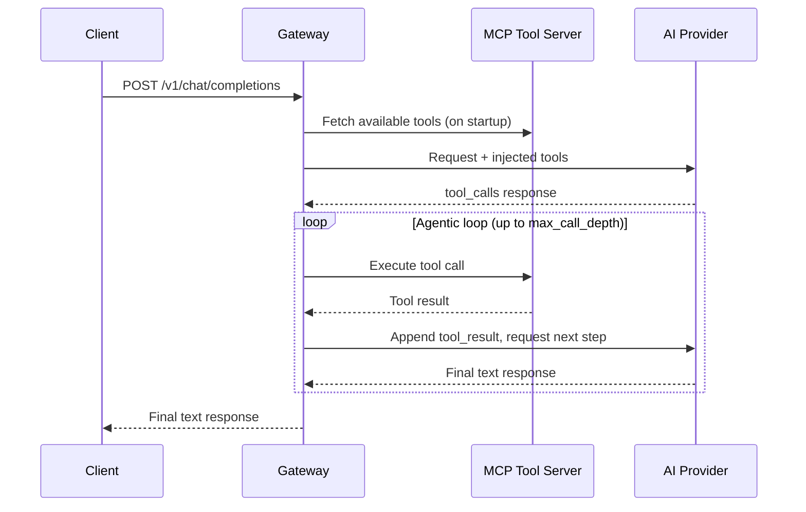

Model Context Protocol (MCP) integration was added in **v0.8.0**. When configured, the gateway connects to your MCP tool servers, injects available tools into chat completion requests, and runs the full agentic loop — so clients can receive a final text answer without implementing tool-calling logic themselves.

## How it works



The agentic loop runs inside the gateway. Your client sends a standard chat completion request and receives the final text answer. The intermediate tool calls are transparent.

## Configuration

Add `mcp_servers` to your `config.yaml`:

```yaml
mcp_servers:
  - name: filesystem
    url: "http://localhost:3001/mcp"
    timeout_seconds: 10
    max_call_depth: 3

  - name: database
    url: "https://mcp-db.internal/mcp"
    headers:
      Authorization: "Bearer ${MCP_DB_TOKEN}"
    allowed_tools:
      - query_readonly
      - list_tables
    timeout_seconds: 15
    max_call_depth: 5
```

### Configuration fields

| Field | Required | Default | Description |
|---|---|---|---|
| `name` | Yes | — | Unique name for this MCP server |
| `url` | Yes | — | HTTP endpoint of the MCP server (Streamable HTTP transport) |
| `headers` | No | `{}` | HTTP headers to include (supports `${ENV_VAR}` interpolation) |
| `allowed_tools` | No | all tools | If set, only these tool names are injected and callable |
| `timeout_seconds` | No | `10` | Per-tool-call HTTP timeout |
| `max_call_depth` | No | `3` | Maximum number of tool call rounds per request |

## Startup behaviour

On `gateway.New()`, MCP connections are initialised in a background goroutine with a 60-second timeout. The gateway is ready to serve requests immediately — MCP tool injection begins once the background init completes. You can call `gateway.MCPInitDone()` to get a channel that closes when initialisation is finished.

## Authentication

MCP servers that require auth can receive credentials via the `headers` field. Environment variable interpolation (`${VAR}`) is supported so secrets are never hardcoded in config files:

```yaml
mcp_servers:
  - name: secure-tools
    url: "https://tools.internal/mcp"
    headers:
      Authorization: "Bearer ${MCP_TOOLS_TOKEN}"
      X-Tenant-ID: "acme-corp"
```

## Tool access control

Use `allowed_tools` to restrict which tools from an MCP server are exposed to the model. This is useful for read-only server access or capability scoping:

```yaml
mcp_servers:
  - name: database
    url: "https://mcp-db.internal/mcp"
    allowed_tools:
      - query_readonly
      - list_tables
    # write/delete tools from this server are NOT injected
```

## Prompt injection risk

:::warning Security note
Allowing the model to execute arbitrary tool calls introduces risk. Always:
- Use `allowed_tools` to whitelist only the tools the model needs
- Prefer read-only tools where possible
- Set `max_call_depth` conservatively (3–5 is usually sufficient)
- Validate and sanitise all data before it reaches write-capable tools
:::

## Compatible MCP servers

The gateway supports MCP servers that implement the **2025-11-25 Streamable HTTP transport**. Popular compatible servers include:

- [Filesystem MCP server](https://github.com/modelcontextprotocol/servers) — read/list/write files
- [Postgres MCP server](https://github.com/modelcontextprotocol/servers) — SQL query execution
- Any server implementing the MCP 2025-11-25 spec with HTTP transport

## Testing the connection

After starting the gateway with `mcp_servers` configured, verify tools are loaded:

```bash
# The gateway logs MCP tool discovery on startup
docker logs ferrogw 2>&1 | grep mcp

# Or check the full tool list via the admin API
curl -H "Authorization: Bearer $ADMIN_API_KEY" \
  http://localhost:8080/admin/mcp/tools
```

## Example: filesystem tools

Start a local filesystem MCP server and connect it to the gateway:

```bash
# 1. Start the MCP filesystem server
npx @modelcontextprotocol/server-filesystem /path/to/workspace

# 2. config.yaml
mcp_servers:
  - name: filesystem
    url: "http://localhost:3000/mcp"
    allowed_tools: [read_file, list_directory, search_files]
    max_call_depth: 4
```

Then ask the model a question that requires reading files:

```python
response = client.chat.completions.create(
    model="claude-3-5-sonnet-20241022",
    messages=[{
        "role": "user",
        "content": "What tests are failing in the src/gateway_test.go file?"
    }],
)
# The gateway reads the file via MCP, sends content to Claude, returns the answer
print(response.choices[0].message.content)
```
