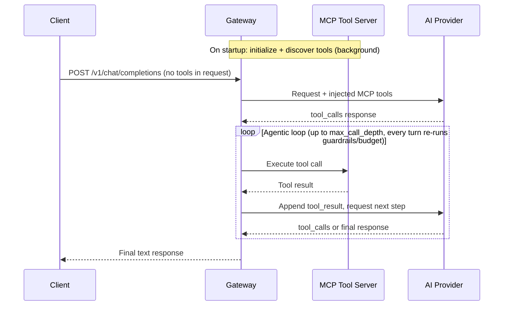

Model Context Protocol (MCP) integration connects the gateway to external tool servers. When `mcp_servers` is configured, the gateway advertises those servers' tools to the model and runs the full agentic loop itself — calling tools over MCP, feeding results back to the model, and repeating until a final answer comes back. Clients get a normal chat completion response; the tool round-trips are invisible.

Two transports are supported: **Streamable HTTP** (`url`) for a running MCP endpoint, and **stdio** (`command` + `args`) for a subprocess the gateway launches and owns for its own lifetime — any `npx` or `uvx` MCP server works without standing up an HTTP endpoint for it. Each `mcp_servers` entry sets exactly one of `url` or `command`; setting both, or neither, is a config error naming the server.

## How it works


```mermaid
sequenceDiagram
    participant Client
    participant Gateway
    participant MCP as MCP Tool Server
    participant LLM as AI Provider

    Note over Gateway,MCP: On startup: initialize + discover tools (background)
    Client->>Gateway: POST /v1/chat/completions (no tools in request)
    Gateway->>LLM: Request + injected MCP tools
    LLM-->>Gateway: tool_calls response
    loop Agentic loop (up to max_call_depth, every turn re-runs guardrails/budget)
        Gateway->>MCP: Execute tool call
        MCP-->>Gateway: Tool result
        Gateway->>LLM: Append tool_result, request next step
        LLM-->>Gateway: tool_calls or final response
    end
    Gateway-->>Client: Final text response
```

Server initialization (the `initialize` + `tools/list` handshake) happens once in a background goroutine when the gateway starts, not per request — the gateway is ready to serve immediately, and MCP tool injection begins once that background init completes. Call `gateway.MCPInitDone()` to get a channel that closes when initialization finishes.

:::note Tools are injected only when the caller sends none
MCP tools are added to a chat completion **only if the request's own `tools` array is empty**. If a client sends its own `tools`, the gateway leaves the request untouched — MCP does not participate, and standard client-side function calling works exactly as it would with MCP disabled. This avoids a turn where the model mixes one MCP-owned call with one caller-owned call that neither side can resolve.
:::

## Configuration

Add `mcp_servers` to your `config.yaml`. A server entry uses either `url` (HTTP) or `command` (stdio):

```yaml
mcp_servers:
  # stdio transport — launched as a subprocess at gateway startup
  - name: filesystem
    command: npx
    args: ["-y", "@modelcontextprotocol/server-filesystem", "/data"]
    env:                        # the subprocess inherits NO gateway environment
      SOME_TOKEN: "${SOME_TOKEN}"
    timeout_seconds: 30         # per tool call; default 30
    required: false             # default false; true gates /readyz on this server

  # Streamable HTTP transport — the gateway connects to a running endpoint
  - name: database
    url: "https://mcp-db.internal/mcp"
    headers:
      Authorization: "Bearer ${MCP_DB_TOKEN}"
    allowed_tools:
      - query_readonly
      - list_tables
    timeout_seconds: 15
    max_call_depth: 5
```

### Configuration fields

| Field | Required | Default | Description |
|---|---|---|---|
| `name` | Yes | — | Unique identifier for this server. Used in logs, metrics labels, and the `/readyz` body |
| `url` | Exactly one of `url` \| `command` | — | Streamable HTTP endpoint. Selects the HTTP transport |
| `command` | Exactly one of `url` \| `command` | — | Executable to launch as an MCP stdio server. Selects the stdio transport; the subprocess starts at gateway init and lives for the gateway's lifetime |
| `args` | No | `[]` | Command-line arguments passed to `command` (stdio only) |
| `env` | No | `{}` | Environment injected into the stdio subprocess (stdio only) — see [Subprocess environment isolation](#subprocess-environment-isolation) |
| `headers` | No | `{}` | HTTP headers sent on every MCP request (HTTP only). Supports `${VAR}` interpolation |
| `allowed_tools` | No | all tools | If set, only these tool names from this server are discovered and exposed to the model |
| `timeout_seconds` | No | `30` | Per-tool-call timeout for this server, both transports |
| `max_call_depth` | No | `5` | Bound on the agentic loop's turn depth. The **minimum positive value across all registered servers** is used |
| `required` | No | `false` | Makes this server's readiness a condition of `/readyz` — see [Readiness and required servers](#readiness-and-required-servers) |

## Subprocess environment isolation

A stdio MCP subprocess does **not** inherit the gateway's environment. It receives a minimal base — `PATH`, `HOME`, `LANG`, `TMPDIR` when set — plus exactly the keys listed in that server's `env`, which override the base. Gateway credentials such as `OPENAI_API_KEY` or `MASTER_KEY` never reach a subprocess implicitly.

This is isolation from *implicit* inheritance, not a prohibition: a value placed in `env` deliberately — including a credential, including one drawn from the gateway's own environment via `${VAR}` — is passed through as configured. Anything a server needs beyond the base four variables (`HTTPS_PROXY`, `NODE_PATH`, `SSL_CERT_FILE`, and on Windows `SYSTEMROOT`/`APPDATA`) must be listed explicitly.

`${VAR}` references in both `headers` and `env` are resolved when the MCP client is constructed, not when the config is loaded — so the config itself never stores the materialized secret, and it never appears in the config-history store or `GET /admin/config`. Only the braced form is a reference; a bare `$` is literal data, and an undefined variable is an error.

```yaml
mcp_servers:
  - name: filesystem
    command: npx
    args: ["-y", "@modelcontextprotocol/server-filesystem", "/data"]
    env:
      SOME_TOKEN: "${SOME_TOKEN}"   # resolved at client construction; ${…} only
```

The subprocess's stderr is drained continuously and logged at debug level (the MCP spec treats stderr output as diagnostic, not an error) — this also prevents a full OS pipe buffer from blocking the child mid-write and stalling JSON-RPC.

## Tool access control

Use `allowed_tools` to restrict which tools from an MCP server are exposed to the model. Filtered tools are never discovered or advertised:

```yaml
mcp_servers:
  - name: database
    url: "https://mcp-db.internal/mcp"
    allowed_tools:
      - query_readonly
      - list_tables
    # write/delete tools from this server are NOT injected
```

## Readiness and required servers

`mcp_servers[].required` (default `false`) makes one server's availability a condition of instance readiness. Every configured server's state is reported in the `GET /readyz` body regardless of `required`, so MCP health can be observed without gating on it:

| `required` | Server unready | `/readyz` |
|---|---|---|
| absent / `false` | reported in the body | `200 ready` |
| `true` | reported in the body | `503`, reason `required mcp server unavailable` |

A server is **unready** when it never completed the `initialize` handshake — including one whose transport could not even be built (an unresolvable `${VAR}` in `headers` or `env`). Death **after** a successful handshake is detected for **stdio servers only**: a crashed subprocess is noticed (its stderr pipe closing, confirmed with an MCP ping before anything is withdrawn) and its tools are withdrawn from the model. An HTTP server that becomes unreachable after a successful handshake is **not currently detected** — it keeps reporting ready with its tools advertised, and calls to it fail per request. Don't rely on `required: true` to pull an instance out of rotation when an HTTP MCP server goes down.

The failure *reason* is deliberately omitted from the unauthenticated `/readyz` body, since it can quote a server URL, an authorization header, or a subprocess command line. It's logged server-side and served on the bearer-authenticated `GET /admin/health` instead (`read_only` or `admin` scope).

Set `required: true` only for a server the deployment genuinely cannot serve without — a required server that's down stops **all** traffic through the instance, including requests that use no tools at all.

## Agentic loop mechanics

Once MCP is active for a request, the executor loops until the model stops requesting tool calls or `max_call_depth` is reached:

- **Ownership.** A tool call is only executed if the gateway's registry owns that tool name. A choice mixing an MCP-owned call with a caller-owned call is never half-executed — it's handed back to the client whole, since the provider would reject an unmatched `tool_call_id`.
- **Depth limit.** At the depth limit, pending MCP-owned tool calls are dropped and the response finishes with `finish_reason: "length"` rather than asking the client to satisfy tools it never declared.
- **Guardrails run on every turn.** Every turn of the loop passes through the same `before_request` plugins (guardrails, rate limiting, budget) that gate the initial provider call — not just the first turn. Tool **results** are content the caller never wrote and the operator has the least reason to trust, so a guardrail can reject a request mid-loop, and a budget check can stop an overspending loop partway through rather than after it completes.
- **Failures reach the model as generic messages** (`timed out`, `server unavailable`, `the tool call failed`) — the real error, which can quote URLs or command lines, is logged server-side only.

:::warning Security note
Allowing the model to execute tool calls introduces risk, and tool **results** are the least-trusted content in the loop — an external MCP server, not the caller, produced them. Guardrails now run every turn for this reason. Additionally:
- Use `allowed_tools` to expose only the tools the model needs
- Prefer read-only tools where possible
- Set `max_call_depth` conservatively (3–5 is usually sufficient)
- Validate and sanitise all data before it reaches write-capable tools
:::

## Observability

MCP exposes dedicated Prometheus series on `/metrics`:

| Metric | Labels | Description |
|---|---|---|
| `gateway_mcp_server_up` | `server_name` | `1` when a server completed its handshake and its transport is alive, `0` otherwise |
| `gateway_mcp_server_init_failures_total` | `server_name` | Incremented each time a server fails to initialize |
| `ferrogw_mcp_tool_calls_total` | `server_name`, `tool_name`, `status` | Total MCP tool calls (`status` is `ok` or `error`) |
| `ferrogw_mcp_tool_call_duration_seconds` | `server_name`, `tool_name` | Latency histogram for individual tool calls |
| `ferrogw_mcp_unknown_tool_calls_total` | `tool_name` | Tool calls the model requested for a name no registered server advertises |

## Example: local filesystem tools via stdio

Point the gateway at a filesystem MCP server with no separate process to manage — the gateway launches it:

```yaml
mcp_servers:
  - name: filesystem
    command: npx
    args: ["-y", "@modelcontextprotocol/server-filesystem", "/path/to/workspace"]
    allowed_tools: [read_file, list_directory, search_files]
    max_call_depth: 4
```

Then ask the model a question that requires reading files. Send no `tools` array so MCP participates:

```python
response = client.chat.completions.create(
    model="claude-sonnet-4-5",
    messages=[{
        "role": "user",
        "content": "What tests are failing in the src/gateway_test.go file?"
    }],
)
# The gateway reads the file via MCP, sends content to the model, returns the answer
print(response.choices[0].message.content)
```

## Example: remote HTTP server with auth

```yaml
mcp_servers:
  - name: secure-tools
    url: "https://tools.internal/mcp"
    headers:
      Authorization: "Bearer ${MCP_TOOLS_TOKEN}"
      X-Tenant-ID: "acme-corp"
```

## Streaming requests

Clients may send `stream: true` when MCP is active. The gateway diverts streaming requests through the full (non-streaming) agentic loop internally — every tool call is resolved inside the gateway — then delivers the final answer as a single SSE chunk once the loop completes. Clients receive correct SSE output without handling intermediate tool-call messages, but the response is not token-by-token for MCP-driven turns:

```python
response = client.chat.completions.create(
    model="claude-sonnet-4-5",
    stream=True,
    messages=[{"role": "user", "content": "List the failing tests in gateway_test.go"}],
)
for chunk in response:
    print(chunk.choices[0].delta.content or "", end="")
```

## Related

- [Configuration reference](/getting-started/configuration)
- [Plugins overview](/plugins)
- [Monitoring](/operations/monitoring)
- [Request lifecycle](/getting-started/request-lifecycle)
