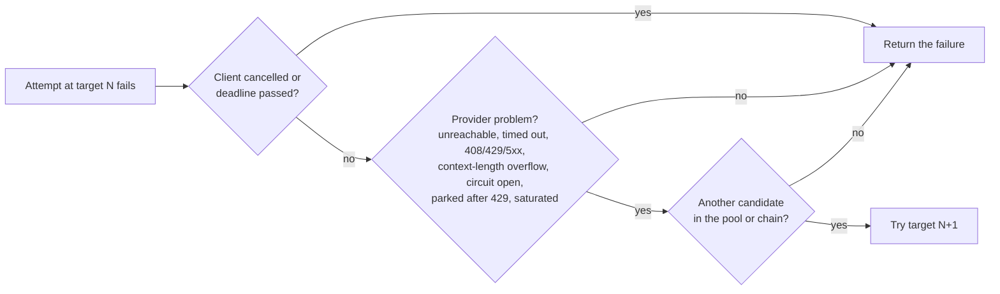

Routing is how the Ferro Labs AI Gateway decides which provider answers a request. One **strategy** governs the whole gateway: it takes each request and returns an ordered list of **targets** to try. A strategy decides *order* and nothing else — retry, circuit breaking, failure classification and capability checks all live once in the request pipeline, so chat, streaming, embeddings, images, rerank, moderation, transcription and speech route identically: the same config and the same health produce the same candidate order on every surface. Ferro Labs ships eight strategies across two families.

:::tip In plain words
You tell the gateway which providers it may use (`targets`) and one rule for choosing between them (`strategy.mode`). A request arrives asking for a model; the gateway works out which of your providers can serve it, tries them in the order the rule gives, and returns one answer. What happens when a provider fails depends on *why* it was chosen: picked as one of several interchangeable options, the request quietly moves on to the next; named on purpose, the request stays inside what was named — a rule can name an ordered chain of stand-ins, and never reaches past it. Every answer says which provider, target and model served it, and how many attempts that took.
:::

## Which one do I pick?

| You want… | Mode | Looks like |
|---|---|---|
| One provider, nothing clever | [`single`](/routing/single) | Everything goes to OpenAI; the gateway adds keys, limits, plugins and logs. |
| A main provider and a backup | [`fallback`](/routing/fallback) | OpenAI first; if it is down or overloaded, Anthropic answers the same request. |
| Traffic shared between providers | [`loadbalance`](/routing/loadbalance) | 70 % OpenAI, 30 % Azure OpenAI; `weight: 0` drains one before you remove it. |
| Whoever answers fastest right now | [`least-latency`](/routing/least-latency) | Groq, OpenAI and Anthropic all serve the model; the quickest one keeps getting the traffic. |
| The cheapest provider per request | [`cost-optimized`](/routing/cost-optimized) | DeepSeek, OpenAI and Anthropic serve the model; the cheapest listed price wins. |
| Some models pinned to one provider | [`conditional`](/routing/conditional) | `claude-*` only ever goes to Anthropic, whatever else is configured. |
| Routing by what the prompt says | [`content-based`](/routing/content-based) | Coding questions to a coding model, translations to a cheap one, the rest to a default. |
| Two options compared on live traffic | [`ab-test`](/routing/ab-test) | 90 % control, 10 % challenger, every answer labelled for analysis afterwards. |

## What a strategy is

A strategy implements a single method, `SelectTargets(req)`, which returns exactly the ordered virtual keys the pipeline may try for a request, most-preferred first — a pool mode's whole pool, a rule's chain, `single`'s one target. That ordering is the whole of its job.

This follows Envoy's split: the route table and load balancer say *where* a request may go, while the retry policy hangs off the route and the circuit breaker off the cluster. In the gateway, the strategy names order; the pipeline (`routeTargets`) owns retry, the circuit breaker, the concurrency limiter, failure classification and "nothing here can serve this". Stating order once and executing it once is why a config orders its targets the same way whether the request streams or not, and the same way on embeddings or speech as on chat: a target that cannot serve a surface is simply not a candidate there.

- A **nil** result means no configured target serves the requested model — the caller reports `404 model_not_found`.
- Only `cost-optimized` (in `skip` mode) can return an error; every other strategy returns a nil error.

## Configure routing

Routing is two top-level blocks in `config.yaml` (or JSON): a `strategy:` block that sets the `mode` plus that mode's own keys, and a flat `targets:` list. There is **no per-route nesting** — one strategy governs the entire gateway.

```yaml
strategy:
  mode: fallback   # single | fallback | loadbalance | least-latency |
                   # cost-optimized | conditional | content-based | ab-test

targets:
  - virtual_key: openai
    retry:
      attempts: 3
  - virtual_key: anthropic
```

Mode-specific keys live under `strategy:` alongside `mode`: `conditions[]` (conditional), `content_conditions[]` (content-based), `ab_variants[]` (ab-test), `unpriced_strategy` (cost-optimized) and `sticky` (loadbalance and ab-test). Each is documented on that strategy's own page. One key applies to every pool mode and rule chain:

| Key | Type | Default | Description |
|---|---|---|---|
| `strategy.failover_on_status_codes` | []int | — | Extra upstream statuses that count as failover-safe, so the walk moves to the next candidate on them. `400`, `401`, `403`, `404` and `422` cannot be listed — a bad request, a bad key or a missing model is the request's problem on every target — and the request's own cancellation or deadline always stops routing. |

:::info `targets` is an allowlist
Setting a provider's credentials registers it, but a provider only routes if it appears in `targets[]`. A request for a model no listed target serves is `404 model_not_found`, even when a registered-but-unlisted provider could have served it. To stop routing to a provider, remove its target.
:::

### The `targets[]` entry

Every entry names one provider registration and optionally attaches per-target resilience. `virtual_key` is the only required field.

| Key | Type | Default | Description |
|---|---|---|---|
| `virtual_key` | string | — (required) | Names a provider registration, typically the provider id. `ferrogw validate` rejects a key no built-in provider matches. |
| `weight` | float64 | `0` | Relative share under `loadbalance`, and the tie-break among equal-cost targets under `cost-optimized`; ignored by every other mode. `0` means zero traffic — the drain lever. |
| `models` | []string | — | Extra exact model IDs this target serves, added to the routing index and `/v1/models`. **Additive only** (never hides what a target already serves), **no wildcards** (rejected at load). |
| `model_map` | map | — | Per-target translation of a name clients use into this target's upstream model ID (`smart: gpt-4o-mini`). The visible name routes to this target and appears in `/v1/models`; the upstream call and pricing use the mapped ID; the response says the visible name. See [One model name, different upstream IDs](#one-model-name-different-upstream-ids). |
| `timeout` | duration | none | Bound on **one** attempt against this target, inside `request_timeout` (which stays authoritative for the whole request). A unary attempt is bounded through its response; a streaming attempt only until the provider answers, since a stream that has begun cannot be replayed elsewhere. An attempt that times out is failover-safe, so a hung primary no longer consumes the whole request budget. |
| `retry` | object | single attempt | Per-target retry policy. Applies under **every** mode — see below. |
| `circuit_breaker` | object | none | Per-target breaker. One per `virtual_key`, shared by all four surfaces. |
| `concurrency` | object | unlimited | In-flight bound with a queue; overflow fails fast with `429`. |

**`retry`** — how many times *one* target is re-asked (advancing to the *next* target is the routing mode's job, not retry's):

| Key | Type | Default | Description |
|---|---|---|---|
| `attempts` | int | `1` | Max attempts against this target. `1` = no retry; the whole `retry` block is optional. |
| `on_status_codes` | []int | transport errors + `408`/`429`/`5xx` | Restrict retryable statuses. Other `4xx` are deterministic client errors and are never retried. |
| `initial_backoff_ms` | int | `100` | Base for exponential backoff with full jitter: wait is drawn from `[0, initial * 2^(attempt-1))`. An upstream `Retry-After` wins; a hint over 30s abandons the target. |

**`circuit_breaker`** — a target whose circuit is open is skipped during selection (see below):

| Key | Type | Default | Description |
|---|---|---|---|
| `failure_threshold` | int | `5` | Consecutive failures before the circuit opens. |
| `success_threshold` | int | `1` | Consecutive half-open successes required to close. |
| `max_half_threshold` | int | `1` | Concurrent probes allowed while half-open. |
| `timeout` | duration | `30s` | How long the circuit stays open before going half-open (e.g. `"30s"`). |

**`concurrency`** — bounds simultaneous in-flight requests (a streaming request holds its slot until the stream ends):

| Key | Type | Default | Description |
|---|---|---|---|
| `max_concurrency` | int | unlimited | Max in-flight requests to this target; capped at `10000`. |
| `queue_size` | int | default queue | Requests allowed to wait for a slot; beyond it the request is shed with `429`. |

### One model name, different upstream IDs

Providers rarely agree on model IDs, so a request for `gpt-4o` cannot simply fail over to Anthropic. `targets[].model_map` gives each target its own translation of a name your clients use:

```yaml
strategy:
  mode: fallback

targets:
  - virtual_key: openai
    model_map:
      smart: gpt-4o
  - virtual_key: anthropic
    model_map:
      smart: claude-sonnet-4-6
```

A client sends `"model": "smart"`. OpenAI is asked for `gpt-4o`; if that fails in a failover-safe way, Anthropic is asked for `claude-sonnet-4-6`. Either way the response says `"model": "smart"` — on every streamed chunk too — so the client sees one stable name whoever answered. `/v1/models` lists `smart`; cost is priced on the mapped ID that actually ran.

`model_map` is per target. `aliases` (see [Configuration](/getting-started/configuration)) is a global rename applied before routing. Use `aliases` to give one real model ID a short name everywhere; use `model_map` when the same name must become a *different* ID on each provider.

## Two mode families

The pipeline splits the modes by what their leading candidate *means*, and that decides whether moving off it is a repair or a betrayal.

| Family | Modes | On a target failure |
|---|---|---|
| **Pool** | `fallback`, `loadbalance`, `least-latency`, `cost-optimized`, `ab-test` | Advances to the next candidate after a **failover-safe** failure; any other failure is returned. |
| **Named** | `single`, `conditional`, `content-based` | Stays inside what was named: `single` stops; a rule walks its `target_keys` chain on the same failover-safe failures and stops at its end. |

A **pool** mode picks its head for a reason that is about the pool rather than the individual target — spread the load, take the cheapest, take the fastest, split the traffic — from targets the operator declared interchangeable, so carrying a failed request to a sibling is what was asked for. A **named** mode picks its head because something named that target specifically (`single` names it; a `conditional` or `content-based` rule matched it), so serving from anyone the rule did not name would demote the rule to a suggestion. A rule may name an ordered chain (`target_keys`); the chain is walked like a pool and is a hard boundary — a rule with one target is exact, and that target being down is the corresponding error, not a sibling's answer.

### Which failures fail over

The gateway moves a request to another target only when the *provider* was the problem — never when the *request* was. Under a pool mode:

| The target… | For example | What happens |
|---|---|---|
| could not be reached | connection refused, DNS failure, connection reset | next target |
| did not answer in time | no response headers before the provider transport's timeout | next target |
| asked you to back off, or was unavailable | `408`, `429`, `502`, `503`, any `5xx` | next target |
| is already being avoided | circuit breaker open, parked after a `429`, concurrency queue full | next target |
| said the prompt is too long for its model | the OpenAI-compatible `context_length_exceeded` code, Anthropic's `prompt is too long`, Gemini's token-count `INVALID_ARGUMENT` | next target — its model may have a larger window |
| answered a status you listed | any code in `strategy.failover_on_status_codes` | next target |
| rejected the request itself | `400`, `401`, `403`, `404`, `422` | **that response goes back to the client** |
| — the client gave up | the caller cancelled, or its deadline passed | routing stops |

Retry (below) re-asks the same target first for a transport failure or a retryable status; a hung attempt, an open circuit and a full queue are never retried and advance at once. Under `single` the one target's result — after its own `retry` — is always the answer; under a rule, the chain is walked on exactly these classes and the last member's result is the answer.



## What every mode shares

Regardless of family:

- **Retry re-asks the same target.** `targets[].retry` is honoured under every mode. It never advances to a different target — only pool modes do that, and only after a failover-safe failure.
- **An open circuit is skipped, among the candidates the mode offers.** Before committing, a target whose breaker is open is passed over in favour of the next candidate — a pool's next sibling, or a rule's next chain member. `single` and a rule with one target offer no next candidate, so an open circuit there is answered `503`.
- **A `429` parks the target.** A target that answers `429` is skipped for its `Retry-After` — five seconds when the header is missing or unusable, a minute at most — so the next request does not pay another `429` on it. The park filters like an open circuit and never refuses a request outright; the target's circuit breaker is untouched, since a rate limit is not a failure of the target.
- **Every answer is attributed.** Every routed surface responds with `X-Gateway-Provider`, `X-Gateway-Target`, `X-Gateway-Model` and `X-Gateway-Attempts` — the canonical provider, the `virtual_key` as you wrote it, the upstream model after `model_map`, and the number of routing-layer attempts. A stream carries them before its first chunk. See [Endpoints](/api-reference/endpoints#attribution-headers).
- **Health is per process.** Circuit state, latency samples and `429` parks are local to one gateway instance; nothing is shared between replicas.
- **All circuits open → `503`.** When every candidate's circuit is open the request is still attempted, the breaker refuses it, and the caller gets `503 upstream_unavailable`. That is deliberately different from `404`: "everything that serves this model is down" is not the same answer as "nothing serves this model".
- **No candidate serves the model → `404`.** When no configured target serves the requested model, nothing is attempted and the caller gets `404 model_not_found`.
- **The response names the model the client asked for.** `model` in the response, and in every streamed chunk, is the requested name after alias resolution — even when `model_map` sent a different ID upstream, and whichever target answered.

## v1.5.2 behaviour changes

Five things an operator may notice after upgrading from 1.5.1:

- **A rule that names one target is exact.** Under `conditional` and `content-based`, an open circuit on the matched target used to borrow a healthy sibling from `targets[]`; it now answers `503`. A rule that wants a stand-in lists one in `target_keys`. On the non-chat surfaces, where content rules cannot be evaluated, `content-based` routes to the first target that can serve the request, alone.
- **Cost ranking prices output too.** `cost-optimized` scores input plus output — the request's `max_tokens` / `max_completion_tokens`, or 256 tokens — so a target that is cheap to read and expensive to write no longer wins a request with a large completion budget. Embedding, image and audio models that tied at zero now rank by their real catalog rate, and equal-cost targets draw by `weight`.
- **Latency samples expire, key by model, and keep exploring.** A target nothing has measured in five minutes is profiled again; one request in ten leads with a runner-up; a stream's sample is its time to first chunk rather than its whole drain.
- **One ranker for every surface.** Embeddings, images, rerank, moderation, transcription and speech previously ranked through a second implementation that drew load-balance starts from a different random source, kept unseen least-latency targets in declared order, and priced cost candidates differently. The same config now orders the same targets the same way everywhere.
- **Unlabelled A/B variants no longer load.** An `ab_variants[]` entry needs a `label`; attribution keys on it. A `single` strategy with more than one target logs a warning naming the unused targets.

## v1.5.1 behaviour changes

Three things an operator may notice after upgrading from 1.5.0 or earlier:

- **Pool modes no longer cover a client error.** Before 1.5.1 they advanced after *any* failure, so a target answering any other `4xx` — `400`, `401`, `403`, `404`, `422` — was silently replaced by a sibling — a revoked key on the primary was invisible. Those responses now reach the client; only failover-safe failures advance ([table above](#which-failures-fail-over)).
- **The response `model` is the routed name.** Responses used to echo whatever identifier the provider reported, such as a dated snapshot like `gpt-4o-2024-08-06`; they now carry the name the client asked for, after alias resolution, on streamed chunks too.
- **Ambiguous configs are rejected at load.** Two targets sharing a `virtual_key`, an empty `virtual_key`, two `ab_variants` naming the same target, or a duplicated key in a JSON config used to load silently, collapsing retry, weight and breaker state for the pair. `ferrogw validate` and startup now refuse them.

## v1.4 breaking changes

Two routing behaviours changed and may need config edits when upgrading:

- **`targets[].retry` now applies under every mode.** It used to run only under `fallback`. If a target carried a `retry` block for use under `fallback` and you now run another mode, set `attempts: 1` to keep the old single-attempt behaviour.
- **`targets` is an allowlist.** A model is routable only through a listed target (plus that target's `models`, the catalog and live discovery). A registered provider that no target names does not route; an unowned model is `404 model_not_found`.

## The eight strategies

| Strategy | Family | Use when |
|---|---|---|
| [Single](/routing/single) | Named | You have one provider and want the gateway as a pure governance and observability layer. |
| [Fallback](/routing/fallback) | Pool | A primary plus backups, where a failed request should be answered by someone else rather than reported. |
| [Load balance](/routing/loadbalance) | Pool | Spreading load across interchangeable providers, weight-shifted migration, or draining one (`weight: 0`) before removal. |
| [Least-latency](/routing/least-latency) | Pool | Time to first token is the objective across equivalent models on several providers. |
| [Cost-optimized](/routing/cost-optimized) | Pool | Cost is the objective and the model catalog carries the prices. |
| [Conditional](/routing/conditional) | Named | Deterministic pinning by model, user, streaming, tool use or a metadata header, with an optional target chain — e.g. for compliance or contract reasons. |
| [Content-based](/routing/content-based) | Named | Prompt-aware selection: code to a code model, translation to a cheap one, sensitive content to a specific backend. |
| [A/B test](/routing/ab-test) | Pool | Comparing model quality or cost on a controlled live traffic split. |

## Related

- [Configuration](/getting-started/configuration) — full YAML/JSON reference
- [Providers](/providers) — what each provider serves and how to register it
- [Circuit breakers and failover](/operations/monitoring) — reading circuit state and metrics
- [Plugins](/plugins) — combine routing with guardrails, budgets and logging
